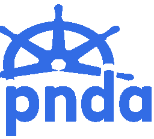

# PNDA Helm Repo

**The PNDA Helm charts are under active development and is not suited for production use.**



## Overview

The PNDA helm charts enable you to deploy PNDA on Kubernetes, the scalable, open source big data analytics platform for networks and services.
It includes references to official helm charts (confluent-platform, jupyterhub, grafana, etc.) and custom helm charts (hbase, hdfs, opentsdb, etc.).

The main chart is named [pnda](pnda) and defines all the pnda components as [requirements](pnda/requirements.yaml). A helm client use the main chart to deploy pnda platform on Kuberentes. The platform componentes and resources can be customized with a user provided profile.yaml (See [Configuration Section](#Configuration)).

## Requirements

Tested with:

- Kubernetes v1.11
- Helm v2.13

## Getting Started

Adding pnda helm repo:

```
helm repo add pndaproject https://pndaproject.github.io/pnda-helm-repo/
helm repo update
```

You need [helm client](https://helm.sh/) configured to manage your kubernetes cluster.

Then you can deploy pnda by providing a profile (e.g. pico profile in this github repo):

```
helm install pndaproject/pnda --name pnda -f profile/pico.yaml
```


## Configuration

Available configuration names and default values are listed in the values.yaml file of each chart:

- pnda [values.yaml](pnda/values.yaml).
- hdfs [values.yaml](hdfs/values.yaml).
- hbase [values.yaml](hbase/values.yaml).
- openstsdb [values.yaml](opentsdb/values.yaml).
- jupyterhub [values.yaml](https://github.com/jupyterhub/zero-to-jupyterhub-k8s/blob/0.8.2/jupyterhub/values.yaml).
- cp-platform [values.yaml](https://github.com/confluentinc/cp-helm-charts/blob/master/values.yaml).
- cp-zookeeper [values.yaml](https://github.com/confluentinc/cp-helm-charts/blob/master/charts/cp-zookeeper/values.yaml).
- cp-kafka [values.yaml](https://github.com/confluentinc/cp-helm-charts/blob/master/charts/cp-kafka/values.yaml).

This values can be overwritten with a user-provided profile file.
Example profiles are included in the profile folder:

- [profile/local.yml](profile/local.yml): profile to deploy pnda in a single computer for development purposes.
- [profile/pico.yml](profile/pico.yml): profile to deploy pnda in a cluster with minimum resources.

## Tests

### Testing locally with minikube

Deploy a local kubernetes with at leat 3 cpus and 4GB RAM with ingress enabled:

```
minikube start --memory=4096 --cpus=3 --kubernetes-version v1.11.8
minikube addons enable ingress
```

Initialize the local Helm CLI and also install Tiller into minikube in one step:

```
helm init --history-max 200
```

Install PNDA platform with helm using local profile:

```
helm install pnda --name pnda -f profile/local.yaml
```

Include vhosts entries pointing to minikube VM IP to access web uis.
e.g for notebooks.pnda.io in a linux client host:
echo "\$(minikube ip) notebooks.pnda.io grafana.pnda.io" | sudo tee -a /etc/hosts

Access jupyerhub at http://notebooks.pnda.io with user pnda password pnda
Access grafana at http://grafana.pnda.io with user pnda password pnda

## Credits

- [Zero to Jupyterhub with Kubernetes](https://zero-to-jupyterhub.readthedocs.io/en/latest/)
- [Confluent Platform helm chart](https://github.com/confluentinc/cp-helm-charts)
